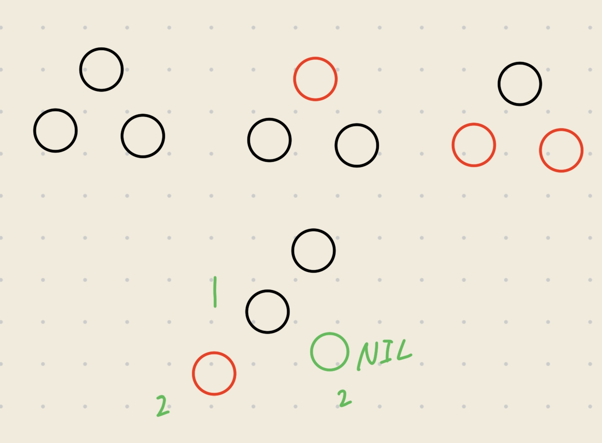
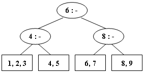

## Red-black tree
!!! question "red-black tree"

    Two red-black trees are said to be different if they have different tree structures or different node colors.  How many different red-black trees are there with 3 internal nodes?  
    A. 1  
    B. 3  
    C. 2  
    D. more than 3

    ??? success "answer"

        D<br>
        
        
## B+ tree        
!!! question "B+ tree"

    A 2-3 tree with 3 nonleaf nodes must have 18 keys at most.  (T/F)

    ??? success "answer"

        T<br>
        key 即为 leafnode 中的记录，非 leafnode 中的不是 key。M order 意思是非根非叶子节点，有 M/2 ~ M 个孩子；然后每个 leafnode 有 M/2 ~ M 个 key。

!!! question "2-3 tree"

    Insert 3, 1, 4, 5, 9, 2, 6, 8, 7, 0 into an initially empty 2-3 tree (with splitting). Which one of the following statements is FALSE?

    A. 7 and 8 are in the same node  
    B. the parent of the node containing 5 has 3 children  
    C. the first key stored in the root is 6  
    D. there are 5 leaf nodes  

    ??? success "answer"

        A<br>
        先把 3,1,4 插入叶子结点，接下来分裂即可。
        
!!! question "2-3 tree"

    After deleting 9 from the 2-3 tree given in the figure, which one of the following statements is FALSE?

    A. the root is full  
    B. the second key stored in the root is 6  
    C. 6 and 8 are in the same node  
    D. 6 and 5 are in the same node

    

    ??? success "answer"

        D<br>
        

!!! question "B+ tree"

    The function FindKey is to check if a given key is in a B+ Tree with its root pointed by root. Return true if key is in the tree, or false if not. The B+ tree structure is defined as following:

    ```c hl_lines="19 22"
    static int order = DEFAULT_ORDER;
    typedef struct BpTreeNode BpTreeNode;
    struct BpTreeNode {
        BpTreeNode** childrens;  /* Pointers to childrens. This field is not used by leaf nodes. */
        ElementType* keys;
        BpTreeNode* parent;
        bool isLeaf;  /* 1 if this node is a leaf, or 0 if not */
        int numKeys;  /* This field is used to keep track of the number of valid keys. 
        In an internal node, the number of valid pointers is always numKeys + 1. */
    };


    bool FindKey(BpTreeNode * const root, ElementType key){
        if (root == NULL) {
                return false;
        }
        int i = 0;
        BpTreeNode * node = root;
        while (_______) {
            i = 0;
            while (i < node->numKeys) {
                if (_______) i++;
                else break;
            }
            node = node->childrens[i];
        }
        for(i = 0; i < node->numKeys; i++){
            if(node->keys[i] == key)
                return true;
        }
        return false;
    }
    ```

    ??? success "answer"
        
        ```c
        while (!node->isLeaf) {
            i = 0;
            while (i < node->numKeys) {
                if (key > node->keys[i]) i++;
                else break;
            }
            node = node->childrens[i];
        }
        ```